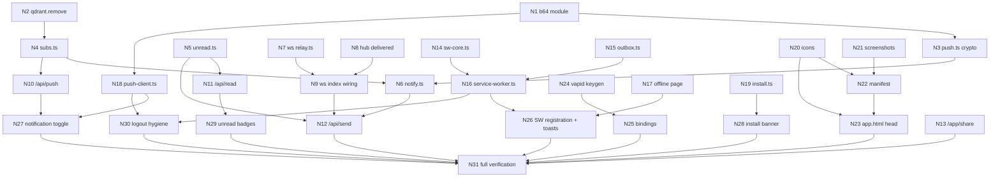

# PWA + Notifications — atomic task graph

Companion to `2026-07-28-pwa-notifications-design.md`. Every node is one atomic edit; every
node names the tests that must go green when it lands. Nothing here is speculative — the
95 failing tests written first are the complete acceptance criteria.

Verify a node with `pnpm vitest run <its test file>`. Verify the whole graph with
`pnpm vitest run && pnpm check && pnpm lint`.

## Dependency graph

## Batches

Nodes in a batch have no dependency on each other and can be done in any order or in parallel.

| Batch | Nodes |
|---|---|
| 1 | N1, N2, N5, N7, N8, N13, N14, N15, N17, N19, N20, N21, N24 |
| 2 | N3, N4, N9, N16, N18, N22, N25 |
| 3 | N6, N10, N11, N23, N26, N28 |
| 4 | N12, N27, N29, N30 |
| 5 | N31 |

---

## Step 1 — server crypto foundation

Batch-1 and batch-2 nodes on the crypto path. Delivered together because N3 is meaningless
without N1 and the whole point of the step is a provably correct encryptor.

### N1 — `src/lib/b64.ts`

Move `b64u` / `unb64u` out of `src/lib/server/qdrant.ts` into a shared module; re-export from
`qdrant.ts` so `session.ts` and every existing caller keep working untouched.

*Why:* `push-client.ts` runs in the browser and needs base64url decoding. Importing it from
`server/qdrant.ts` would drag `@qdrant/js-client-rest` into the client bundle.

Green: every existing suite stays green (`session.test.ts` in particular).

### N2 — `remove()` in `src/lib/server/qdrant.ts`

`export async function remove(env: QEnv, ids: string[]): Promise<void>` — `delete` on the
collection, no-op on an empty list, `.catch(() => {})` like its siblings.

*Why:* pruning a dead push subscription is the first thing in this codebase that deletes a
point. Nothing else needs to change.

Green: N4's `subs.test.ts` once it lands.

### N3 — `src/lib/server/push.ts`

The VAPID + payload-encryption core. Exports:

| Export | Contract |
|---|---|
| `MAX_PLAINTEXT` | `4096 - 16 salt - 4 rs - 1 idlen - 65 key - 16 tag - 1 delimiter` |
| `encrypt_payload(sub, plaintext, seed?)` | RFC 8291 ECDH + RFC 8188 `aes128gcm`; `seed` injects a fixed salt and application-server key for the RFC test vector |
| `vapid_auth(keys, endpoint, now?)` | RFC 8292 `vapid t=<ES256 JWT>,k=<pubkey>`; `aud` is the endpoint origin only, `exp` inside 24h, raw 64-byte signature |
| `push_topic(conv)` | stable, ≤32 chars, URL-safe — collapses a thread at the push service |
| `clamp_payload(obj)` | JSON that always fits one record; truncated `body` ends in `…` |
| `send_push(sub, payload, keys, opts?, f?)` | `{ ok, status, gone }`; `gone` on 404/410; one retry on 429/500/503; never throws |

Key derivations, in order: `PRK_key = HMAC(auth, ecdh)`, `IKM = HMAC(PRK_key, "WebPush: info"‖0x00‖ua_pub‖as_pub‖0x01)`,
`PRK = HMAC(salt, IKM)`, `CEK = HMAC(PRK, "Content-Encoding: aes128gcm"‖0x00‖0x01)[0..16]`,
`NONCE = HMAC(PRK, "Content-Encoding: nonce"‖0x00‖0x01)[0..12]`. Body framing:
`salt(16) ‖ rs(4) ‖ idlen(1) ‖ as_public(65) ‖ AES-GCM(plaintext ‖ 0x02)`.

Green: `src/lib/server/__tests__/push.test.ts` — 36 tests, including a byte-exact framing
check against the RFC 8291 §5 vector and an independent receiver-side round-trip decrypt.

---

## Step 2 — subscription and unread storage

### N4 — `src/lib/server/subs.ts` *(deps: N2)*
`PushSub` record (`s:'ps'`), id `uuid_from(endpoint)` so a re-subscribe upserts. `save_sub`
rejects a non-https endpoint or missing keys before writing. `list_subs_many` fans out per uid
and de-duplicates by endpoint. Green: `subs.test.ts` (17).

### N5 — `src/lib/server/unread.ts`
`Read` record (`s:'rd'`), id `read:<uid>:<conv>`. `mark_read` never moves a marker backwards.
`unread_by_conv(env, uid, group_convs?)` counts messages newer than the marker and not sent by
the reader, omitting fully-read threads rather than reporting zero. Green: `unread.test.ts` (16).

---

## Step 3 — relay reports who it missed

### N7 — `ws/src/relay.ts`
`relay(body, ns)` → `null` when there is no target, else `{ ok, undelivered }`. A hub that
throws, or answers with anything other than `{delivered:true}`, counts as undelivered — for a
chat app a duplicate notification beats a silently lost message. Green: `relay.test.ts` (13).

### N8 — `ws/src/hub.ts`
`deliver()` returns the socket count; `/relay` answers `{ delivered: n > 0 }`. Leave the
`{type:'msg',…}` socket payload byte-identical — an existing test asserts its exact shape.
Green: the two new `hub-do.test.ts` cases.

### N9 — `ws/src/index.ts` *(deps: N7, N8)*
Replace the inline fan-out with `relay()`; 400 on `null`, else return its JSON. Delete the
`[WS-RELAY]` console noise while in there.

---

## Step 4 — orchestration

### N6 — `src/lib/server/notify.ts` *(deps: N3, N4)*
`notify(env, uids, payload)` → `{ sent, pruned }`. Loads subs once, clamps, sends in parallel
with a `push_topic`, batches the `gone` endpoints into one `delete_subs`, and swallows every
error — a push failure must never fail a send. Silent no-op when VAPID is unconfigured.
Green: `notify.test.ts` (10).

---

## Step 5 — API surface

### N10 — `src/routes/api/push/+server.ts` *(deps: N4)*
`GET` the public key (503 when unconfigured, never the private key), `POST` subscribe (400 on a
malformed body or a rejected endpoint, not 500), `DELETE` unsubscribe (idempotent).
Green: `api/push` (15).

### N11 — `src/routes/api/read/+server.ts` *(deps: N5)*
`GET` → `{ total, by_conv }`, passing the caller's groups as `g:<id>` conversations via the
existing `list_groups(env, uid)`. `POST` marks read and returns the fresh total.
Green: `api/read` (10).

### N13 — `src/routes/app/share/+server.ts`
Share-target receiver. Signed-out → redirect to `/login`. Reads `title`/`text`/`url`/`image`,
stores an image through `put_image` keyed to the sharer, redirects to `/app` with
`share_text` / `share_image`. Green: `app/share` (9).

### N12 — `src/routes/api/send/+server.ts` *(deps: N5, N6, N9)*
Read the relay's JSON; on a non-JSON or thrown response treat every recipient as undelivered.
Push to that set minus the sender. Direct message: title = sender username, body = text,
`url=/app/chat/<sender>`, `conv=conv_id`, plus the recipient's `total_unread`. Group: title =
group name, body = `"<sender>: <text>"`, `url=/app/groups/<id>`, `conv=g:<id>`, no unread
lookup. Image key becomes `/media/<key>`. Green: `api/send` (20).

---

## Step 6 — service worker

### N14 — `src/lib/sw-core.ts`
Pure decisions only, no `self`. `cache_mode` bypasses non-GET, `/api/*`, `/logout`, `/google`,
`/login`, cross-origin, non-http schemes and Range requests; `immutable` for precached build
output, `cache-first` for `/media/*`, `network-first` otherwise. `notification_from` always
returns something visible, tags `x2:<conv>`, sets `renotify`, attaches reply/mark-read actions
only when there is a conversation, and describes a photo-only message. `target_url` refuses an
off-origin url. `should_notify` is false only for a visible *and* focused client on that
conversation. Green: `sw-core.test.ts` (46).

### N15 — `src/lib/outbox.ts`
`queue` and `drain` over an injected store. `drain` sends oldest-first, keeps failures,
increments `tries`, drops at `MAX_TRIES`, treats a thrown post as a failure, and keeps going
after one message fails. Green: `outbox.test.ts` (13).

### N16 — `src/service-worker.ts` *(deps: N14, N15)*
The shim: precache `build`+`files`+`/offline` on install without `skipWaiting`; drop stale
caches and `clients.claim()` on activate; route fetch through `cache_mode`, never caching a
non-`is_cacheable` response; `push` always shows a notification, honours `should_notify`, and
sets the app badge; `notificationclick` handles inline reply (queueing to the outbox on
failure), mark-read, and client focus; `pushsubscriptionchange` re-subscribes and
re-registers; `sync` on `x2-outbox` drains; `message` handles `SKIP_WAITING` and `CLEAR_CACHES`.
Backed by an IndexedDB store implementing `OutStore`.

### N17 — `src/routes/offline/+page.svelte`
Static fallback page, no data loading.

---

## Step 7 — client modules

### N18 — `src/lib/push-client.ts` *(deps: N1)*
`push_available` gates iOS on `display-mode: standalone`. `push_state` → `unsupported` /
`blocked` / `off` / `on`. `enable_push` requests permission, reuses an existing subscription
rather than churning, subscribes with `userVisibleOnly`, and registers server-side.
`disable_push` still tells the server when the local unsubscribe throws. `sync_subscription`
never prompts. Green: `push-client.test.ts` (24).

### N19 — `src/lib/install.ts`
Captures and suppresses `beforeinstallprompt`, consumes it once, clears on `appinstalled`,
remembers a dismissal for `REASK_MS` (14 days) and survives storage throwing in private
browsing. `ios_hint_needed` covers iPad reporting as Macintosh. Green: `install.test.ts` (18).

---

## Step 8 — assets

### N20 — `scripts/icons.mjs` + `static/icons/*.png`
Rasterize `static/logo.svg` with inkscape: `icon-192`, `icon-512`, `maskable-192`,
`maskable-512` (20% safe-zone padding), `apple-touch-icon` (180, opaque background — iOS does
not composite alpha), `badge-96` (monochrome).

### N21 — `static/icons/screenshot-wide.png`, `screenshot-narrow.png`
One 1280×720 and one 720×1280, captured from the running app.

### N22 — `static/manifest.webmanifest` *(deps: N20, N21)*
Every field the design lists, `theme_color` and `background_color` `#0b0b0c`.

### N23 — `src/app.html` *(deps: N20, N22)*
Manifest link, `viewport-fit=cover`, theme-color, `color-scheme: dark`, apple-touch-icon,
both `*-web-app-capable` metas, iOS status-bar style and title.

Green (with N16, N17): `pwa-assets.test.ts` (39).

---

## Step 9 — configuration and UI

### N24 — `scripts/vapid.mjs`
Generates a P-256 keypair with WebCrypto and prints the base64url public key and private `d`.
Run once; the output goes to the Secrets Store.

### N25 — bindings *(deps: N24)*
`VAPID_PUBLIC`, `VAPID_PRIVATE`, `VAPID_SUBJECT` in `wrangler.jsonc` `secrets_store_secrets`
and in `Env` in `worker-configuration.d.ts`.

### N26 — `src/routes/+layout.svelte` *(deps: N16, N17)*
Register the service worker on mount, prompt on `registration.waiting` and reload on
`controllerchange`, show an offline banner from `navigator.onLine`, and reconcile the app badge
from `/api/read` on focus.

### N27 — notification toggle *(deps: N10, N18)*
Per-device control in `src/routes/app/profile/+page.svelte`. Four states: unsupported, blocked
with recovery instructions, off with a soft-ask explaining the value, on. The only place
`Notification.requestPermission` is ever reached, and only from a click.

### N28 — install banner *(deps: N19)*
Dismissible prompt plus the iOS Share → Add to Home Screen hint.

### N29 — unread badges *(deps: N11)*
Counts on the bottom nav and the conversation list; `mark_read` on opening a thread;
`setAppBadge` / `clearAppBadge` from the page.

### N30 — logout hygiene *(deps: N16, N18)*
`disable_push()`, `clearAppBadge()` and a `CLEAR_CACHES` message before the redirect, so a
shared device does not keep receiving the previous user's messages.

### N31 — verification
`pnpm vitest run && pnpm check && pnpm lint`, then a real install on Android and iOS: install,
enable notifications, background the app, receive a push, tap it, reply inline.

## Repair scopes

If a node fails, re-plan only its step, not the graph. The crypto step (N1–N3) is the one with
a wide blast radius: N6, N10 and N12 all assume it. Everything else fails locally.
